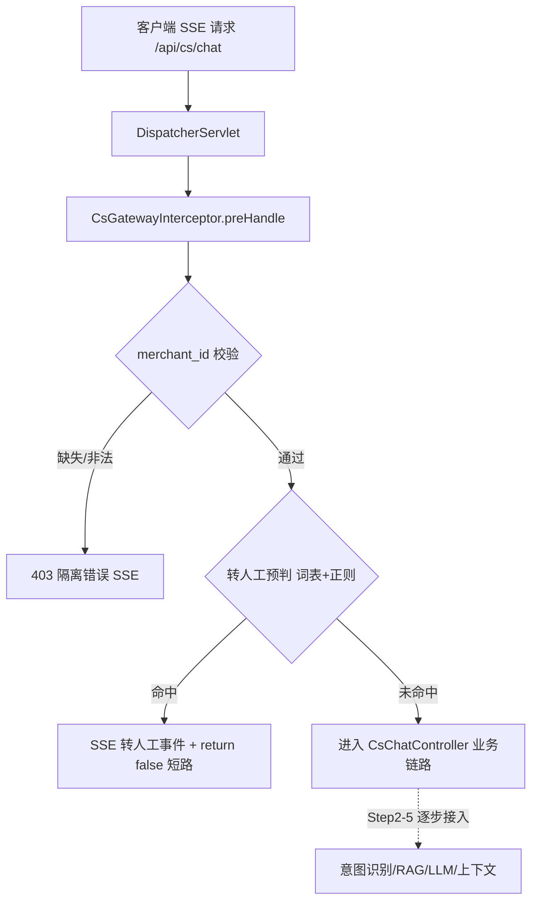

## 用户需求

采用 Builder + Inspector 双 Agent 的 Loop Engineering 循环模式，从零构建「UniSelect 客服 Agent（代码实现版）」后端核心服务。当前仅执行 **Step 1：项目基础结构与前置拦截器**。

## 产品概述

在工作区根目录新建一个 Spring Boot 3.x（Maven）工程 `uniselect-cs-agent`，作为客服 Agent 后端服务的骨架。本步骤交付可启动的工程基础结构与网关拦截器，实现 `merchant_id` 严格校验与毫秒级前置转人工预判（短路）。

## 核心特性

- 标准 Spring Boot 3.x Maven 工程骨架：pom.xml、application.yml、主启动类、统一包结构（config / interceptor / controller / common / dto）。
- 网关拦截器（HandlerInterceptor）：在请求进入业务前完成 `merchant_id` 非空与格式校验（<50ms，不查库），缺失或非法直接拒绝（返回隔离错误，不默认任何商家数据）。
- 前置转人工预判：使用「平台默认触发词表 + 正则」对用户输入做确定性匹配（退款/投诉/人工等），命中即短路，直接返回 SSE 转人工事件，不进入 LLM 链路（<10ms）。
- 统一 SSE 出入口：Controller 暴露 `/api/cs/chat` 端点，返回 `SseEmitter`；预留转人工事件结构与降级兜底。
- 商家业务层占位：提供可扩展的 merchant 配置读取接口（Mock 实现，后续 Step 接入 DB），支持平台默认词与商家追加词的合并。
- 埋点占位：预留统一埋点接口与字段（转人工触发、merchant_id 拒绝），供 Step 5 落地。

## 技术栈选择

- 语言/框架：Java 17 + Spring Boot 3.4.x（Maven），Java 17 基线（record、var、Stream）。
- Web：Spring WebMvc + `SseEmitter`（单向流式推送，客服场景无需 WebSocket 双向）。
- 外部依赖：本步骤不引入 pgvector / Redis / 真实 LLM；用内存 Map 与硬编码 Mock 跑通主流程，适配器接口预留以便后续无缝切换。
- 工具：Lombok（减少样板）、SLF4J（日志，打印前脱敏 merchant 信息，不打印用户输入原文全量）。

## 实现方案（Step 1）

采用「拦截器前置短路」策略：请求经 `DispatcherServlet` → `CsGatewayInterceptor.preHandle` 先做 merchant_id 校验（<50ms，纯参数校验不查库），再做转人工预判（<10ms，词表+正则命中即写 SSE 转人工事件并 `return false` 短路）。业务逻辑入口 `CsChatController` 持有 SseEmitter，当前仅处理转人工短路回包；正常问答链路在 Step 2~4 逐步接入。

关键技术决策：

- **merchant_id 校验前置且不查库**：满足红线"网关/鉴权/merchant_id 校验 <50ms"与"严格行级隔离"底线，缺失即拒绝，杜绝串店。
- **转人工预判纯确定性匹配**：词表（Set 精确匹配）+ 正则（模糊如"要.*人工"）两级，命中直接短路，绝不进 LLM，成本与延迟最优，可测试可审计。
- **拦截器返回 SSE 事件**：通过 `response` 直接写 SSE 格式（避免进入 Controller 后再发），实现真正短路；提供 `SseEventWriter` 工具类统一事件封装。
- **商家词表可扩展**：`MerchantConfigService`（Mock）按 merchant_id 返回默认词+追加词，为 Step 3 的 DB 读取预留接口。

## 实现注意事项

- 性能：拦截器内只做字符串操作与 Set 查询，O(1)；严禁在 preHandle 中查库/调远程。
- 日志：仅记录 merchant_id、命中词、耗时（debug），不打印完整用户输入；避免日志刷屏。
- 向后兼容：预留 `ChatRequest`/`ChatResponse`/`SseEvent` 结构，后续 Step 直接复用；不重构无关逻辑。
- 隔离底线：任何未带/非法 merchant_id 的请求一律 403 隔离错误，不兜底默认商家。

## 架构设计



## 目录结构

```
uniselect-cs-agent/
├── pom.xml                              # [NEW] Maven 构建文件，Spring Boot 3.4 + Lombok 依赖
├── src/main/resources/
│   └── application.yml                  # [NEW] 服务端口、SSE 超时、拦截器开关等基础配置
└── src/main/java/com/uniselect/cs/
    ├── CsAgentApplication.java          # [NEW] Spring Boot 主启动类
    ├── config/
    │   └── WebConfig.java               # [NEW] 注册 CsGatewayInterceptor 到拦截路径
    ├── common/
    │   ├── constant/
    │   │   └── SystemRuleConstants.java # [NEW] 平台默认转人工触发词表、越权词占位常量（系统规则层占位）
    │   ├── dto/
    │   │   ├── ChatRequest.java         # [NEW] 入参：sessionId, merchantId, message
    │   │   ├── SseEvent.java            # [NEW] SSE 事件封装（type/data），转人工/降级/普通消息
    │   └── util/
    │       └── SseEventWriter.java      # [NEW] 向 HttpServletResponse 写 SSE 事件的工具
    ├── interceptor/
    │   └── CsGatewayInterceptor.java    # [NEW] 核心：merchant_id 校验 + 转人工预判短路
    ├── service/
    │   ├── MerchantConfigService.java   # [NEW] 商家配置接口（默认词+追加词合并），Mock 实现
    │   └── MerchantConfigServiceMock.java # [NEW] Mock 实现，内存 Map 按 merchant_id 返回词表
    ├── controller/
    │   └── CsChatController.java        # [NEW] /api/cs/chat SSE 端点，持 SseEmitter，当前仅承接正常链路占位
    └── aspect/
        └── MetricsCollector.java        # [NEW] 埋点占位切面/接口，预留转人工触发与拒绝计数（Step5 落地）
```

## 关键代码结构

```java
// 转人工预判结果
public record HandoffDecision(boolean hit, String matchedWord) {}

// 拦截器核心契约
public interface PreCheckService {
    boolean validateMerchantId(String merchantId);          // 非空+格式，不查库
    HandoffDecision predictHandoff(String merchantId, String message); // 词表+正则，<10ms
}
```