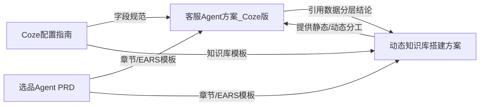

## 用户需求

执行 `CodeBuddy需求Prompt_客服与导购Agent方案.md`，为"UniSelect 商家客服中心"产出系列 PRD 文档。本轮按用户确认先交付最核心的 2 份：客服 Agent 方案（Coze 版）与动态知识库搭建方案。

## 产品概述

面向跨境电商商家客服中心的 AI 智能体方案文档。本轮两份文档均遵循已确认的"底层复用、上层差异化"原则——底层共用 Coze 工作空间/Bot/PAT/API 渠道，上层以差异化的人设 Prompt 与知识库内容区分客服与导购场景（导购场景仅做预留，本轮不展开）。多商家隔离以 `merchant_id` 为隔离键重新定义。

## 核心特性

- 客服 Agent 方案（Coze 版）：按选品 Agent PRD 章节结构撰写；明确两层 Prompt 分工（基础人设+平台系统规则仅平台维护 / 商家业务 Prompt 商家可改）、知识库内容规划、转人工规则定义、与 agent.html / admin.html 字段对接；提供"Coze 侧配置项 ↔ 客服平台字段"对照表。
- 动态知识库搭建方案：定义数据分层（静态知识库 vs 动态实时查询）；设计定时同步（方案 A）与实时查询（方案 B，Function Calling）两种同步机制，分别给出 Coze 版本（插件/工具）与代码实现版本（RAG + Tool Use）的落地思路；覆盖触发方式、清洗格式化、索引更新、异常降级；明确 merchant_id 隔离与一致性；给出 EARS 验收标准与待确认问题清单。
- 写作规范：一级标题用中文数字编号；大量使用表格；验收标准用 EARS 五分类；开头含版本/状态/最后更新元信息块；Coze 字段命名与《Coze 智能体准备配置指南》一致；技术选型给出推荐方案并标注可替换备选，不确定项汇入待确认问题清单。

## 技术栈

- 纯 Markdown 文档交付，无代码工程；编辑器遵循仓库现有 .md 风格（参考 `选品Agent_PRD草案(2).md` 与 `Coze智能体准备配置指南.md`）。
- 文档内描述的技术架构（代码直实现版对比、知识库同步）使用文字描述 + 表格 + mermaid 流程图，不写真实代码。

## 实现方法

- 严格复用《选品 Agent PRD》的章节骨架与 EARS 写法作为模板；复用《Coze 智能体准备配置指南》的字段名（Bot ID / API Key(PAT) / baseUrl / model / 商家 Prompt / 转人工规则）、两层 Prompt 分工、知识库 5.2 分工表与 5.4 markdown 模板、第八章字段对照表结构。
- 关键决策：多商家隔离用 `merchant_id` 行级隔离重定义（不沿用 team_id）；技术选型给出推荐（向量库 Milvus/Redis、定时任务 FaaS、消息队列 Kafka/RabbitMQ 等）并标注备选与"待确认"。
- 性能与可靠性：知识库同步方案需说明索引生效延迟控制、商品系统不可用时降级策略，避免脏数据或整体报错。

## 实现备注

- 所有表格与字段命名必须与 Coze 指南保持一致，不创新术语。
- 两份文档互引：客服 Coze 版引用动态知识库方案的"数据分层"结论，避免重复建设。
- 末尾必须含"待确认问题清单"表格与"风险与排期评估"章节。

## 架构设计

两份文档内部关系：



## 目录结构

```
c:\Users\Asus\Desktop\客服 Agent 方案 + 导购 Agent\
├── 客服Agent方案_Coze版.md      # [NEW] 客服 Agent（Coze 版）PRD。按选品PRD章节结构撰写：背景/目标/用户故事/功能清单/流程/交互/数据指标/EARS验收/边界场景/权限与数据口径(merchant_id隔离)/埋点/待确认问题/风险与排期；含两层Prompt分工、知识库内容、转人工规则、Coze配置项↔客服平台字段对照表。
└── 动态知识库搭建方案.md        # [NEW] 动态知识库专项方案。数据分层(静态vs动态)、定时同步(方案A)+实时查询(方案B,Function Calling)、Coze版(插件/工具)与代码版(RAG+Tool Use)实现、触发/清洗/索引/降级、merchant_id隔离、EARS验收、待确认问题清单。
```