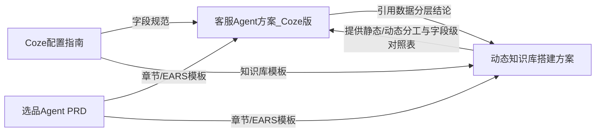

## 产品概述

为"UniSelect 商家客服中心"产出本轮最核心的 2 份 PRD 文档：客服 Agent 方案（Coze 版）与动态知识库搭建方案。两份文档遵循"底层复用、上层差异化"原则——底层共用 Coze 工作空间/Bot/PAT/API 渠道，上层以差异化人设 Prompt 与知识库内容区分场景。多商家隔离以 `merchant_id` 为隔离键重新定义。

## 核心特性

- 客服 Agent 方案（Coze 版）：按选品 Agent PRD 章节结构撰写；明确两层 Prompt 分工（系统规则层由平台统一维护、商家不可覆盖/绕过；商家业务 Prompt 商家可改）；转人工规则定义为"平台默认触发词 + 商家可追加关键词"两级关系；知识库内容规划；与 agent.html/admin.html 字段对接对照表（复用 Coze 指南第八章表结构）；注明该分层可被后续导购版直接复用。
- 动态知识库搭建方案：数据分层（静态知识库 vs 动态实时查询）；字段级同步对照表（库存/价格走实时查询，商品规格/图文/售后政策/活动优惠券走定时同步）；定时同步（方案A）+ 实时查询（方案B，Function Calling）双机制，分别给出 Coze 版（插件/工具）与代码版（RAG + Tool Use）落地思路；覆盖触发方式、清洗格式化、索引更新、异常降级；merchant_id 隔离；以字段为锚点的 EARS 验收标准；待确认问题清单。
- 写作规范：一级标题中文数字编号；大量表格；EARS 五分类；开头元信息块；Coze 字段命名与指南一致；技术选型给推荐方案并标注可替换备选。

## 技术栈

- 纯 Markdown 文档交付，无代码工程；编辑器遵循仓库现有 `.md` 风格（参考 `选品Agent_PRD草案(2).md` 与 `Coze智能体准备配置指南.md`）。
- 文内技术架构（知识库同步、Coze vs 代码版对比）使用文字描述 + 表格 + mermaid 流程图，不写真实代码。

## 实现方法

- 严格复用选品 Agent PRD 章节骨架与 EARS 写法作为模板；复用 Coze 指南字段名（Bot ID / API Key(PAT) / baseUrl / model / 商家 Prompt / 转人工规则）、两层 Prompt 分工、知识库 5.2 分工表与 5.4 markdown 模板、第八章字段对照表结构。
- 关键决策 1（两层 Prompt 分工收紧）：系统规则层硬红线（不泄露其他商家信息、不擅自改订单/退款/价格、敏感问题必转人工）跨商家统一、不可覆盖，方案中明确"该层内容由平台统一维护，任何商家业务 Prompt 不得覆盖、降级或绕过"；转人工 = 平台默认触发词（退款/投诉/法律/人身安全，商家不可删）+ 商家可追加关键词；与 admin.html（平台管理员开"自定义 Agent"开关）、agent.html（商家配置 商家 Prompt / 转人工规则 字段）权限模型对齐；注明此分层可被后续导购版直接复用。
- 关键决策 2（字段级同步对照表）：动态知识库方案给出具体字段级对照表（库存数量/价格→实时查询每次对话触发；商品规格图文→定时同步重建 15-30 分钟或变更事件；售后政策→定时同步低频；活动优惠券→定时同步+有效期校验 活动开始/结束触发）；EARS 验收以该表字段为锚点写具体降级条款（如库存实时查询失败时降级提示而非返回陈旧值）。
- 关键决策 3：多商家隔离以 `merchant_id` 行级隔离重定义（不沿用 team_id）；技术选型给推荐（向量库 Milvus/Redis、定时任务 FaaS、消息队列 Kafka/RabbitMQ）并标注备选与"待确认"。

## 实现备注

- 所有表格与字段命名必须与 Coze 指南保持一致，不创新术语。
- 两份文档互引：客服 Coze 版引用动态知识库方案的"数据分层"结论，避免重复建设。
- 末尾必须含"待确认问题清单"表格与"风险与排期评估"章节。
- 性能与可靠性：知识库同步需说明索引生效延迟控制、商品系统不可用时降级策略，避免脏数据或整体报错。

## 架构设计



## 目录结构

```
c:\Users\Asus\Desktop\客服 Agent 方案 + 导购 Agent\
├── 客服Agent方案_Coze版.md      # [NEW] 客服 Agent（Coze 版）PRD。按选品PRD章节：背景/目标/用户故事/功能清单/流程/交互/数据指标/EARS验收/边界场景/权限与数据口径(merchant_id隔离)/埋点/待确认问题/风险与排期；含两层Prompt分工(系统规则层平台维护不可覆盖)+转人工两级关系+知识库内容+Coze配置项↔客服平台字段对照表；注明分层可复用于导购版。
└── 动态知识库搭建方案.md        # [NEW] 动态知识库专项方案。数据分层(静态vs动态)+字段级同步对照表；定时同步(方案A)+实时查询(方案B,Function Calling)；Coze版(插件/工具)与代码版(RAG+Tool Use)实现；触发/清洗/索引/降级；merchant_id隔离；以字段为锚点的EARS验收；待确认问题清单。
```