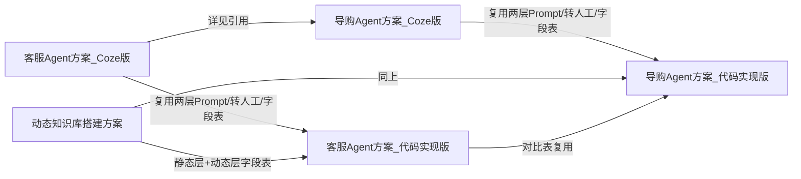

## 产品概述

在 Phase1 已完成的 2 份核心文档（客服 Agent 方案 Coze 版、动态知识库搭建方案）基础上，本轮完成两件事：(1) 对已完成 2 份文档做 2 处小修正（不改结构，仅打磨表述与补承接点）；(2) 按锁定标准依次产出剩余 3 份 PRD 文档：客服 Agent 方案（代码实现版）、导购 Agent 方案（Coze 版）、导购 Agent 方案（代码实现版）。

## 核心特性

- 两处小修正：客服 Coze 版 2.3 业务目标改为可量化锚点（首字响应 P95 ≤ 2s，阈值待评审），第七章埋点补对照基线说明，其余模糊条目补锚点或标"待评审定基线"；动态知识库方案 7.2 末尾补承接句指向代码实现版。
- 客服代码实现版：技术架构重写（意图识别→RAG→Prompt 组装→LLM→规则拦截→转人工→回复），系统规则层硬编码服务端不可变、商家业务层 DB 读取；Tool Use 调商品系统 API（动态层字段同知识库方案）；7.2 节给清洗脚本接口级伪代码；Coze 版 vs 代码版对比表；EARS 覆盖 Prompt 组装失败降级、Tool Use 超时降级、系统规则层不可被 DB 配置覆盖。
- 导购 Coze 版：系统规则层与转人工两级机制、动态知识库均复用已有文档（详见引用，不重定义）；差异化展开推荐搭配、促单话术、追问挖掘、推荐理由可解释、转化漏斗埋点；交互体现"促成转化"vs"解决问题"；新增客服/导购协同一节；埋点新增转化漏斗。
- 导购代码实现版：结构同客服代码版，模块换推荐引擎、个性化排序、话术生成、转化埋点；同样给出对比表（复用客服代码版结构仅调差异点）。

## 写作规范

中文数字章节标题、表格驱动、EARS 五分类、开头元信息块（版本/状态/更新日期/关联文档）；末尾保留"待确认问题清单"与"风险与排期评估"；重叠结论用"详见《XXX》第 X 章"引用不重写；技术选型给推荐+备选+汇总待确认。

## Tech Stack

- 纯 Markdown 文档交付，无代码工程；编辑器遵循仓库现有 .md 风格（参考已完成的 4 份文档与选品 PRD）。
- 文内技术架构使用文字描述 + 表格 + mermaid 流程图（代码实现版伪代码仅函数签名 + 输入输出结构，非可运行代码）。

## Implementation Approach

- 严格复用已锁定的硬约束：两层 Prompt 分工（Coze 版 Bot 内锁定 / 代码版服务端硬编码强制拦截）、转人工两级触发词（平台默认不可删 + 商家追加）、merchant_id 行级隔离、动态知识库字段级对照表（库存/价格/订单/物流=实时查询；规格图文/政策/运费=定时同步；活动券=事件触发+有效期校验）、实时查询失败降级不返回旧值。
- 重叠结论一律用"详见《XXX》第 X 章"引用，避免多份文档重复定义导致后续维护不一致。
- 修正项仅改表述不改结构；代码实现版 7.2 伪代码呼应动态知识库方案 7.2 留白。
- 对比表复用《动态知识库搭建方案》7.5 结构扩展到整体架构维度（开发成本/上线速度/可定制性/供应商依赖/长期维护成本），导购代码版复用客服代码版对比表仅调差异点。
- 技术选型（向量库 Milvus/Redis、消息队列 Kafka/RabbitMQ、定时 FaaS、LLM 网关）给推荐 + 备选 + 汇总待确认清单。

## Implementation Notes

- 每完成一份新文档，立即与已有文档交叉校验术语、字段命名（Bot ID/API Key/baseUrl/model/merchant_id）、章节编号，确保一致。
- 动态数据字段范围（库存/价格/订单/物流）必须与《动态知识库搭建方案》第五章字段级对照表完全一致，不得增减。
- 导购版"促成转化"目标须与客服版"解决问题"目标在交互说明中明确区分，避免话术雷同。
- 客服/导购协同节需明确会话是否共用（建议共用 sessionId，场景标签切换，转人工规则一致）。

## Architecture Design



## Directory Structure

```
c:\Users\Asus\Desktop\客服 Agent 方案 + 导购 Agent\
├── 客服Agent方案_Coze版.md          # [MODIFY] 2.3 业务目标改为可量化锚点(P95≤2s)；第七章埋点补对照基线；其余模糊条目补锚点/标待评审
├── 动态知识库搭建方案.md            # [MODIFY] 7.2 节末尾补承接句指向代码实现版伪代码设计
├── 客服Agent方案_代码实现版.md      # [NEW] 技术架构重写+Tool Use+7.2伪代码+对比表+EARS
├── 导购Agent方案_Coze版.md          # [NEW] 复用声明+导购差异化+协同节+转化漏斗埋点
└── 导购Agent方案_代码实现版.md      # [NEW] 推荐引擎/个性化排序/话术生成/转化埋点+对比表
```